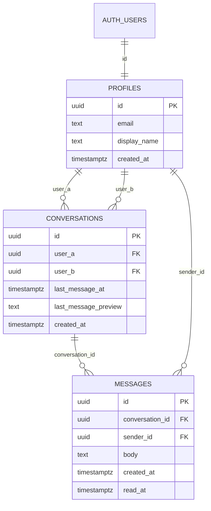

# ARCHITECTURE — Akselera.Tech Internal Chat

| | |
|---|---|
| **Versi** | 1.0 |
| **Dokumen terkait** | [PRD.md](./PRD.md) · [AGENT_HANDOFF.md](./AGENT_HANDOFF.md) · [PROGRESS.md](./PROGRESS.md) |
| **Prinsip** | *Secure by default, simple by design, fast by construction.* |

---

## 1. Ringkasan Keputusan

| Lapisan | Pilihan | Alasan (ditulis ulang di README) |
|---|---|---|
| Framework | **Next.js** (App Router, TypeScript) | Wajib dari task. Server Components memberi data awal tanpa waterfall; Server Actions memusatkan validasi |
| UI | **Tailwind CSS** + `next-themes` | Design token light/dark sederhana, bundle kecil, tanpa flash tema |
| Database | **Supabase Postgres** | Relasional cocok untuk chat; **RLS** membuat isolasi data terjadi di level database, memenuhi aturan D walau API diakses langsung |
| Auth | **Supabase Auth** (email + password) | Sesi/JWT terintegrasi dengan RLS (`auth.uid()`), rate limit bawaan, tanpa membangun auth sendiri |
| Realtime | **Supabase Realtime** (Postgres Changes + Presence) | Bawaan; Postgres Changes menghormati RLS; tanpa layanan tambahan |
| Hosting | **Vercel** (Hobby) | Integrasi Next.js terbaik, deploy dari GitHub, URL publik gratis |
| Validasi | **zod** | Skema tunggal untuk validasi server & tipe |
| Paket | **pnpm** | Cepat, lockfile deterministik |

**Alternatif yang dipertimbangkan (untuk README):**

| Alternatif | Kenapa tidak dipilih |
|---|---|
| Firebase (Firestore) | Security Rules kuat, tetapi NoSQL; query daftar chat + unread + pencarian lebih rumit; tim CRM kemungkinan butuh relasional |
| Neon + Auth.js | Postgres bagus, tapi tanpa RLS/Realtime bawaan → harus membangun auth, otorisasi manual, dan layanan realtime (Pusher/Ably) sendiri → lebih banyak kode & risiko keamanan |
| Custom WebSocket server | Tidak cocok di serverless Vercel; menambah biaya & kompleksitas |

**Trade-off yang diterima:** project Supabase free **auto-pause setelah 1 minggu tanpa aktivitas** → dimitigasi keep-alive (§10). Free tier: 500 MB DB, 50.000 MAU, 5 GB egress, 2 project aktif — sangat cukup untuk task ini.

## 2. Arsitektur Tingkat Tinggi

```mermaid
flowchart LR
  subgraph Browser
    UI[React UI\nServer + Client Components]
    RT[Supabase browser client\nHANYA Realtime + Presence]
  end
  subgraph Vercel["Vercel (region sin1)"]
    PX[proxy/middleware\nrefresh sesi + redirect]
    RSC[Server Components\n+ Server Actions\n+ /api/health]
  end
  subgraph Supabase["Supabase (region Singapore)"]
    AU[Auth]
    PG[(Postgres + RLS)]
    RL[Realtime]
  end
  UI -->|navigasi, form| PX --> RSC
  RSC -->|JWT pengguna dari cookie\n(anon key + RLS)| PG
  RSC --> AU
  RT <-->|WebSocket + JWT| RL
  RL --- PG
  CRON[Vercel Cron harian] -->|/api/health| RSC
```

**Aturan emas akses data**
1. Runtime aplikasi **hanya** memakai `URL` + `anon/publishable key` + **JWT milik pengguna**. Tidak ada service role di runtime.
2. Semua query berjalan sebagai pengguna → **RLS selalu berlaku**, bahkan bila ada bug di kode aplikasi.
3. Klien browser tidak menulis data; ia hanya subscribe Realtime/Presence. Mutasi lewat Server Actions.
4. `SUPABASE_SERVICE_ROLE_KEY` hanya untuk `scripts/seed.ts` di mesin lokal.

## 3. Struktur Proyek

```
akselera-chat/
├─ docs/                       # PRD, ARCHITECTURE, AGENT_HANDOFF, PROGRESS
├─ AGENTS.md                   # pointer ke docs/AGENT_HANDOFF.md (lihat handoff §9)
├─ public/brand/               # logo-black.*, logo-white.*  (aset dari File Asset)
├─ supabase/migrations/
│  ├─ 0001_schema.sql          # tabel, indeks, trigger
│  ├─ 0002_rls_and_functions.sql
│  └─ 0003_realtime_and_hardening.sql
├─ scripts/
│  ├─ seed.ts                  # buat akun sampel (service key, lokal saja)
│  └─ verify-rls.ts            # bukti isolasi data
├─ src/
│  ├─ proxy.ts                 # (Next 16) atau middleware.ts (Next ≤15) — cek versi terpasang
│  ├─ app/
│  │  ├─ layout.tsx            # font Nunito, ThemeProvider, header brand
│  │  ├─ page.tsx              # redirect ke /chat atau /login
│  │  ├─ (auth)/login/page.tsx
│  │  ├─ (auth)/register/page.tsx
│  │  ├─ (auth)/actions.ts     # signIn, signUp, signOut (Server Actions)
│  │  ├─ (app)/layout.tsx      # requireUser() + ChatProvider
│  │  ├─ (app)/chat/layout.tsx # sidebar + panel
│  │  ├─ (app)/chat/page.tsx   # empty state
│  │  ├─ (app)/chat/[conversationId]/page.tsx
│  │  ├─ (app)/chat/actions.ts # sendMessage, startConversation, markRead, searchUsers, loadOlder
│  │  ├─ api/health/route.ts   # keep-alive
│  │  ├─ not-found.tsx · error.tsx · loading.tsx
│  ├─ components/{brand,theme,chat,ui}/
│  ├─ hooks/                   # useRealtime, usePresence, useAutoScroll
│  ├─ lib/
│  │  ├─ supabase/{server,client,proxy}.ts
│  │  ├─ auth/{requireUser,safeRedirect}.ts
│  │  ├─ validation/{auth,chat}.ts   # zod
│  │  └─ format/time.ts        # Asia/Jakarta, id-ID
│  └─ types/database.ts        # dihasilkan: supabase gen types
├─ .env.example                # HANYA nama variabel, tanpa nilai
└─ README.md
```

## 4. Autentikasi & Proteksi Rute (Defense in Depth)

Lima lapis; kegagalan satu lapis tidak membocorkan data:

| Lapis | Mekanisme | Melindungi |
|---|---|---|
| 1 | `proxy.ts`/`middleware.ts`: refresh cookie sesi; redirect `/chat*` tanpa sesi → `/login?next=…`; `/login` dengan sesi → `/chat` | UX & alur (aturan A) |
| 2 | `(app)/layout.tsx` memanggil `requireUser()` → `supabase.auth.getUser()` (verifikasi ke Auth server, **bukan** `getSession()`) | Bila proxy terlewat/bypass |
| 3 | Setiap Server Action memanggil `requireUser()` lagi | Pemanggilan action langsung |
| 4 | **RLS** di semua tabel | Akses REST/Realtime langsung |
| 5 | Column-level grants + trigger hardening | Manipulasi kolom |

Detail penting:
- **Login** = Server Action `signIn` → validasi zod → `signInWithPassword` → error apa pun dikembalikan sebagai `"Email atau password salah"` → sukses `redirect(safeRedirect(next) ?? '/chat')`.
- **Logout** = Server Action (POST) → `signOut()` → `redirect('/login')`. Klien memanggil `supabase.removeAllChannels()` dan mengosongkan state.
- **`safeRedirect(next)`**: hanya terima string diawali `/` dan **bukan** `//` atau `/\`; selain itu `null`.
- **Cache**: halaman `(app)` dinamis (`export const dynamic = 'force-dynamic'`) + header `Cache-Control: no-store` agar tombol Back/CDN tidak menampilkan data pengguna lain.
- Sesi dikelola `@supabase/ssr` (cookie). Jangan menyimpan token di `localStorage` manual.
- **Registrasi (bonus)**: `signUp({ email, password, options: { data: { display_name } } })`; trigger DB membuat profil. Password minimal 8 karakter (validasi zod + pengaturan Supabase Auth). Konfirmasi email dimatikan (D-6).

## 5. Model Data

### 5.1 Diagram



### 5.2 Skema (referensi untuk migrasi)

> Agent: pecah menjadi 3 file migrasi seperti di §3. Uji ulang dengan `verify-rls` setiap ada perubahan.

```sql
-- ===== 0001_schema.sql =====
create table public.profiles (
  id           uuid primary key references auth.users(id) on delete cascade,
  email        text not null,
  display_name text not null check (char_length(display_name) between 1 and 60),
  created_at   timestamptz not null default now()
);
create unique index profiles_email_lower_key on public.profiles (lower(email));

create table public.conversations (
  id                   uuid primary key default gen_random_uuid(),
  user_a               uuid not null references public.profiles(id) on delete cascade,
  user_b               uuid not null references public.profiles(id) on delete cascade,
  last_message_at      timestamptz,
  last_message_preview text,
  created_at           timestamptz not null default now(),
  constraint conversations_ordered check (user_a < user_b),   -- kanonik, dan mencegah chat dengan diri sendiri
  constraint conversations_pair_key unique (user_a, user_b)   -- mencegah duplikat
);
create index conversations_user_b_idx on public.conversations (user_b);

create table public.messages (
  id              uuid primary key default gen_random_uuid(),   -- boleh dikirim klien (idempotensi/optimistic)
  conversation_id uuid not null references public.conversations(id) on delete cascade,
  sender_id       uuid not null default auth.uid() references public.profiles(id) on delete cascade,
  body            text not null check (char_length(btrim(body)) between 1 and 2000),
  created_at      timestamptz not null default now(),
  read_at         timestamptz
);
create index messages_conv_created_idx on public.messages (conversation_id, created_at desc, id desc);
create index messages_unread_idx       on public.messages (conversation_id) where read_at is null;
create index messages_sender_time_idx  on public.messages (sender_id, created_at desc);

-- Profil otomatis saat akun dibuat (seed & registrasi)
create function public.handle_new_user() returns trigger
language plpgsql security definer set search_path = '' as $$
begin
  insert into public.profiles (id, email, display_name)
  values (
    new.id, new.email,
    left(coalesce(nullif(btrim(new.raw_user_meta_data->>'display_name'), ''), split_part(new.email, '@', 1)), 60)
  );
  return new;
end $$;
create trigger on_auth_user_created after insert on auth.users
  for each row execute function public.handle_new_user();

-- Denormalisasi pesan terakhir agar daftar chat = 1 query
create function public.touch_conversation() returns trigger
language plpgsql security definer set search_path = '' as $$
begin
  update public.conversations
     set last_message_at = new.created_at,
         last_message_preview = left(new.body, 120)
   where id = new.conversation_id;
  return new;
end $$;
create trigger messages_after_insert after insert on public.messages
  for each row execute function public.touch_conversation();
```

```sql
-- ===== 0002_rls_and_functions.sql =====
alter table public.profiles      enable row level security;
alter table public.conversations enable row level security;
alter table public.messages      enable row level security;

-- Cabut hak default, beri hak minimum (column-level untuk insert pesan)
revoke all on public.profiles, public.conversations, public.messages from anon, authenticated;
grant select on public.profiles      to authenticated;
grant select, insert (user_a, user_b) on public.conversations to authenticated;
grant select on public.messages      to authenticated;
grant insert (id, conversation_id, body) on public.messages to authenticated; -- sender_id/created_at/read_at TIDAK bisa diisi klien

-- profiles: semua pengguna terautentikasi boleh melihat (dibutuhkan "Chat baru"); tanpa policy tulis
create policy profiles_select on public.profiles for select to authenticated using (true);

-- conversations: hanya peserta
create policy conversations_select on public.conversations for select to authenticated
  using ((select auth.uid()) in (user_a, user_b));
create policy conversations_insert on public.conversations for insert to authenticated
  with check ((select auth.uid()) in (user_a, user_b));

-- messages: baca hanya di percakapan sendiri; kirim hanya sebagai diri sendiri di percakapan sendiri; TANPA update/delete
create policy messages_select on public.messages for select to authenticated
  using (exists (select 1 from public.conversations c
                 where c.id = conversation_id and (select auth.uid()) in (c.user_a, c.user_b)));
create policy messages_insert on public.messages for insert to authenticated
  with check (sender_id = (select auth.uid())
              and exists (select 1 from public.conversations c
                          where c.id = conversation_id and (select auth.uid()) in (c.user_a, c.user_b)));

-- Mulai / ambil percakapan (idempoten, kanonik, validasi lawan bicara via FK)
create function public.start_conversation(other_user uuid) returns uuid
language plpgsql security invoker set search_path = '' as $$
declare me uuid := auth.uid(); a uuid; b uuid; cid uuid;
begin
  if me is null then raise exception 'not authenticated' using errcode = '28000'; end if;
  if other_user is null or other_user = me then raise exception 'invalid user' using errcode = '22023'; end if;
  a := least(me, other_user); b := greatest(me, other_user);
  insert into public.conversations (user_a, user_b) values (a, b)
    on conflict (user_a, user_b) do nothing returning id into cid;
  if cid is null then
    select id into cid from public.conversations where user_a = a and user_b = b;
  end if;
  return cid;   -- other_user tak terdaftar => pelanggaran FK => error (aturan B)
end $$;

-- Daftar chat: 1 query (lawan bicara, cuplikan, waktu, unread). SECURITY INVOKER => RLS berlaku
create function public.list_my_conversations()
returns table (id uuid, other_id uuid, other_name text, other_email text,
               last_message_at timestamptz, last_message_preview text, unread_count int)
language sql stable security invoker set search_path = '' as $$
  select c.id, p.id, p.display_name, p.email, c.last_message_at, c.last_message_preview,
         (select count(*)::int from public.messages m
           where m.conversation_id = c.id and m.read_at is null
             and m.sender_id <> (select auth.uid()))
    from public.conversations c
    join public.profiles p
      on p.id = case when c.user_a = (select auth.uid()) then c.user_b else c.user_a end
   where (select auth.uid()) in (c.user_a, c.user_b)
   order by c.last_message_at desc nulls last, c.created_at desc;
$$;

-- Tandai dibaca: satu-satunya jalur UPDATE (SECURITY DEFINER, tapi memeriksa keanggotaan sendiri)
create function public.mark_conversation_read(conv uuid) returns void
language sql security definer set search_path = '' as $$
  update public.messages m set read_at = now()
   where m.conversation_id = conv and m.read_at is null
     and m.sender_id <> (select auth.uid())
     and exists (select 1 from public.conversations c
                 where c.id = conv and (select auth.uid()) in (c.user_a, c.user_b));
$$;

-- Fungsi hanya untuk pengguna login (Postgres memberi EXECUTE ke PUBLIC secara default!)
revoke execute on function public.start_conversation(uuid), public.list_my_conversations(),
                            public.mark_conversation_read(uuid) from public, anon;
grant  execute on function public.start_conversation(uuid), public.list_my_conversations(),
                           public.mark_conversation_read(uuid) to authenticated;
-- Fungsi trigger tidak boleh dipanggil langsung
revoke execute on function public.handle_new_user(), public.touch_conversation() from public, anon, authenticated;
```

```sql
-- ===== 0003_realtime_and_hardening.sql =====
alter publication supabase_realtime add table public.messages, public.conversations;

-- Rate limit kirim pesan: maks 20 pesan / 10 detik / pengguna
create function public.enforce_message_rate() returns trigger
language plpgsql security definer set search_path = '' as $$
begin
  if (select count(*) from public.messages
       where sender_id = new.sender_id and created_at > now() - interval '10 seconds') >= 20 then
    raise exception 'rate limit exceeded' using errcode = '54000';
  end if;
  return new;
end $$;
create trigger messages_before_insert_rate before insert on public.messages
  for each row execute function public.enforce_message_rate();
revoke execute on function public.enforce_message_rate() from public, anon, authenticated;

-- Keep-alive (dipanggil /api/health dengan anon key)
create function public.ping() returns int
language sql security definer set search_path = '' as $$ select 1 $$;
grant execute on function public.ping() to anon, authenticated;

-- Presence privat (Realtime Authorization) — verifikasi sintaks terbaru di docs Supabase
-- create policy "auth can use presence" on realtime.messages for select to authenticated
--   using (realtime.topic() = 'presence:online');
-- create policy "auth can track presence" on realtime.messages for insert to authenticated
--   with check (realtime.topic() = 'presence:online');
```

> **Jebakan yang harus dihindari agent**
> - `VIEW` di Postgres berjalan dengan hak pemilik dan **melewati RLS** kecuali `with (security_invoker = true)`. Karena itu daftar chat memakai **fungsi `SECURITY INVOKER`**, bukan view biasa.
> - Fungsi `SECURITY DEFINER` selalu `set search_path = ''` dan memeriksa `auth.uid()` sendiri.
> - `(select auth.uid())` (dibungkus subquery) dipakai di policy agar dievaluasi sekali per query (performa).
> - Jangan pernah membuat policy `using (true)` pada `conversations`/`messages`.

## 6. Alur Data

### 6.1 Memuat halaman
```
GET /chat/[id]
 └─ proxy: refresh sesi ─▶ layout: requireUser()
     ├─ rpc list_my_conversations()         (sidebar, SSR)
     └─ select messages where conversation_id = id
        order by created_at desc, id desc limit 50   (SSR; dibalik untuk tampilan)
        → jika kosong & percakapan tak terlihat (RLS) ⇒ notFound()
```
Kedua query berjalan paralel (`Promise.all`). Halaman tidak melakukan fetch tambahan di klien saat pertama render.

### 6.2 Mengirim pesan (optimistic)
```mermaid
sequenceDiagram
  participant U as UI (Composer)
  participant SA as Server Action sendMessage
  participant DB as Postgres (RLS)
  participant RT as Realtime
  participant R as UI penerima
  U->>U: buat id = crypto.randomUUID(); tampilkan bubble "mengirim"
  U->>SA: {id, conversationId, body}
  SA->>SA: requireUser() + zod (trim, 1..2000)
  SA->>DB: insert (id, conversation_id, body)  -- JWT pengguna
  DB->>DB: RLS check + trigger touch_conversation + rate limit
  DB-->>SA: ok (atau error → UI tandai "gagal, coba lagi")
  DB-->>RT: WAL INSERT (RLS dicek per penerima)
  RT-->>U: echo INSERT → dedupe by id
  RT-->>R: INSERT → tampil + markRead bila thread terbuka
```
Retry aman: `id` dari klien → bila duplikat (`23505`) dianggap sukses (idempoten).

### 6.3 Realtime (satu channel per sesi)
- `ChatProvider` (client) membuat **satu** channel `chat:{userId}` dengan dua listener: `INSERT` pada `messages` dan `INSERT/UPDATE` pada `conversations`. **Tanpa filter di klien** — RLS memastikan hanya baris milik pengguna yang dikirim.
- Reducer state: `conversations`, `messagesByConversation`, `unread`, `online`.
- Pesan masuk: (a) thread terbuka → append + `markRead` (debounce 500 ms); (b) thread lain → `unread++`, preview & waktu diperbarui, item naik ke atas.
- Reconnect: saat `online`/`visibilitychange`/status `SUBSCRIBED` kembali → refetch `list_my_conversations` + pesan thread aktif (menutup celah pesan yang terlewat).

### 6.4 Presence (status online)
- Channel privat `presence:online`; `track({ user_id })` sekali setelah `SUBSCRIBED`. Nilai online = set `user_id` di presence state. **Tidak menulis ke DB.**
- Bila Realtime Authorization sulit di jangka waktu task, fallback: channel publik dengan payload minimal (`user_id` saja) dan catat sebagai keterbatasan di README.

### 6.5 Unread & pencarian
- **Unread**: `unread_count` dari `list_my_conversations()`; `mark_conversation_read` dipanggil saat thread dibuka/pesan masuk saat terbuka.
- **Cari chat**: filter sisi klien atas daftar yang sudah dimuat (nama + cuplikan, case-insensitive).
- **Cari pengguna (dialog Chat baru)**: Server Action `searchUsers(q)` → `profiles` `ilike` pada `display_name`/`email`, `id <> me`, `limit 20`, `%`/`_`/`\` di-escape, debounce 250 ms.

## 7. Frontend

- **Server Components** untuk shell, sidebar awal, dan riwayat; **Client Components** hanya untuk composer, thread interaktif, dialog, toggle tema, provider realtime.
- **Tema**: `next-themes` (`attribute="class"`, `defaultTheme="system"`, `enableSystem`, storage `localStorage` → memenuhi B-3, tanpa flash). Logo: **dua `` dengan class `dark:hidden` / `hidden dark:block`** (hindari hydration mismatch).
- **Font**: `next/font/google` Nunito (variable, `display: 'swap'`, subset `latin`) dipasang di `<html>`; `input, button, textarea { font-family: inherit }`.
- **Token warna** sebagai CSS variables di `:root` dan `.dark` (nilai di PRD §9), dipetakan ke Tailwind.
- **Layout**: `h-dvh`, sidebar `w-[320px]` di ≥ md; < md route-based (daftar ↔ thread). Composer memakai `padding-bottom: env(safe-area-inset-bottom)`.
- **Dialog Chat baru**: elemen native `<dialog>` + `showModal()` (focus trap & `Esc` gratis).
- **Waktu**: util `formatTime()` fixed `Asia/Jakarta`, `id-ID` (`09.42`, `Kemarin`, `Senin`).
- **Pesan**: render `{message.body}` sebagai teks (React meng-escape), `white-space: pre-wrap; overflow-wrap: anywhere`. **Dilarang `dangerouslySetInnerHTML`.**
- **Scroll**: auto-scroll ke bawah hanya bila pengguna berada di dekat dasar; muat pesan lebih lama via `IntersectionObserver` di puncak (cursor `created_at,id`).

## 8. Keamanan

### 8.1 Model ancaman ringkas

| Ancaman | Vektor | Kontrol |
|---|---|---|
| Baca chat orang lain | REST/PostgREST langsung, Realtime, manipulasi `conversationId` | RLS `select` berbasis peserta; `notFound()` generik |
| Kirim pesan sebagai orang lain | Mengirim `sender_id` palsu | `sender_id` bukan kolom yang boleh diisi klien (default `auth.uid()`), policy `with check` |
| Sisipkan pesan ke percakapan orang lain | Insert dengan `conversation_id` orang lain | Policy `insert` + `exists` peserta |
| Ubah/hapus pesan | PATCH/DELETE REST | Tidak ada policy & tidak ada grant UPDATE/DELETE |
| Chat dengan user fiktif/diri sendiri | Panggil `start_conversation` dengan UUID acak | FK + `check(user_a < user_b)` + validasi fungsi |
| Bypass proteksi rute | Kerentanan middleware / akses langsung Server Action | `getUser()` di layout & di setiap action; RLS sebagai jaring terakhir |
| Bocor secret | Commit `.env`, `NEXT_PUBLIC_` salah pakai | `.gitignore`, `.env.example`, service key hanya di skrip lokal, `import 'server-only'` di modul server, cek `git log -p` |
| XSS | Isi pesan/nama berisi HTML/script | Render teks polos, CSP, tanpa `dangerouslySetInnerHTML` |
| CSRF | Form lintas situs | Server Actions (POST + pengecekan origin bawaan Next), cookie `SameSite=Lax`; Route Handler mutasi (jika ada) cek `Origin` |
| Open redirect | `?next=https://evil` | `safeRedirect()` |
| Brute-force / enumerasi akun | Login massal, pesan error berbeda | Rate limit Supabase Auth, pesan error generik |
| Spam/DoS pesan | Loop kirim | Trigger rate limit 20/10 dtk, batas 2000 karakter |
| Wildcard search abuse | `%` / `_` di `ilike` | Escape + `limit 20` |
| Cache leak | Back button / CDN | `no-store`, `force-dynamic` |
| Pause/DoS ketersediaan | Project idle | Keep-alive terjadwal |

### 8.2 Manajemen secret

| Variabel | Lokasi | Boleh di browser? |
|---|---|---|
| `NEXT_PUBLIC_SUPABASE_URL` | Vercel + `.env.local` | Ya (publik) |
| `NEXT_PUBLIC_SUPABASE_ANON_KEY` (dashboard bisa menamainya *publishable key*) | Vercel + `.env.local` | Ya — aman **karena RLS** |
| `SUPABASE_SERVICE_ROLE_KEY` (*secret key*) | **Hanya** `.env.local` lokal untuk `seed`/`verify-rls` | **TIDAK. Jangan set di Vercel.** |
| `CRON_SECRET` (opsional) | Vercel | Tidak |

Aturan: `.env*` di `.gitignore` (kecuali `.env.example`); jangan ada nilai asli di README/commit; bila secret pernah ter-commit → **rotasi** di dashboard, bukan hanya menghapus commit. Akun sampel dikirim ke rekruter lewat pesan, bukan disimpan di repo.

### 8.3 Security headers (`next.config.ts`)
`X-Content-Type-Options: nosniff` · `X-Frame-Options: DENY` (+ `frame-ancestors 'none'`) · `Referrer-Policy: strict-origin-when-cross-origin` · `Permissions-Policy: camera=(), microphone=(), geolocation=()` · `Strict-Transport-Security` (Vercel menyediakan HTTPS) · **CSP** minimum: `default-src 'self'; img-src 'self' data:; style-src 'self' 'unsafe-inline'; connect-src 'self' https://*.supabase.co wss://*.supabase.co; frame-ancestors 'none'; base-uri 'self'; form-action 'self'` (script-src memakai nonce bila waktu cukup; bila tidak, catat sebagai "belum selesai" di README).

### 8.4 Verifikasi keamanan (`scripts/verify-rls.ts`)
Skrip membuat klien dengan **anon key** yang login sebagai user A, B, dan C (dari seed), lalu memastikan:

| # | Uji | Hasil yang diharapkan |
|---|---|---|
| 1 | Anon (tanpa login) `select` `messages`/`conversations`/`profiles` | 0 baris / ditolak |
| 2 | C `select` percakapan A–B dan pesannya | 0 baris |
| 3 | C `insert` pesan dengan `conversation_id` A–B | Ditolak (RLS) |
| 4 | A `insert` pesan dengan `sender_id` = B | Ditolak (grant kolom / RLS) |
| 5 | A `update`/`delete` pesan sendiri | Ditolak |
| 6 | A `insert` `conversations` (A, C) tak berurutan / dengan B–C | Ditolak |
| 7 | A `rpc('mark_conversation_read', percakapan B–C)` | 0 baris berubah |
| 8 | A `rpc('start_conversation', uuid_acak)` / diri sendiri | Error |
| 9 | A mengirim 21 pesan cepat | Pesan ke-21 ditolak (rate limit) |
| 10 | Subscribe Realtime sebagai C ke `messages` lalu A–B kirim pesan | C tidak menerima event |

Keluarkan ringkasan PASS/FAIL; simpan hasilnya di README.

## 9. Performa

| Area | Teknik |
|---|---|
| Waktu muat | Data awal via Server Components (tanpa spinner berlapis); `loading.tsx` skeleton; logo SVG; font self-hosted `next/font` |
| Query | Indeks komposit `(conversation_id, created_at desc, id desc)`; cursor pagination; daftar chat 1 RPC; denormalisasi `last_message_*` |
| RLS | `(select auth.uid())` agar di-cache per query; policy sederhana tanpa join berlapis |
| Realtime | 1 channel/sesi; tanpa polling; refetch hanya saat reconnect/fokus |
| UI | Optimistic send; `React.memo` pada item pesan/daftar; state minimal; hindari re-render seluruh daftar |
| Bundle | Client Components seperlunya; tanpa lodash/moment/UI kit; `next/dynamic` untuk dialog Chat baru bila perlu; cek `next build` output |
| Jaringan | Vercel function region `sin1` + Supabase Singapore (`vercel.json`: `"regions": ["sin1"]`) |
| Ukuran payload | Preview 120 karakter; halaman 50 pesan; `select` kolom eksplisit (tanpa `select *`) |

**Anggaran (dicek di produksi):** Lighthouse mobile ≥ 90/95/95, LCP < 2,5 dtk, CLS < 0,1, JS awal `/login` sekecil mungkin (target < 100 kB gzip).

## 10. Deploy, Operasional & Keep-Alive

1. Supabase: buat project **region Singapore**; jalankan migrasi (`supabase db push` atau SQL editor berurutan); Auth → matikan *Confirm email*; set Site URL & Redirect URL ke domain Vercel.
2. Generate tipe: `supabase gen types typescript --project-id … > src/types/database.ts`.
3. `pnpm seed` (lokal) untuk akun sampel; `pnpm verify-rls`.
4. Vercel: import repo GitHub, set env (kecuali service role), region `sin1`.
5. **Keep-alive**: `/api/health` memanggil `supabase.rpc('ping')` dengan anon key dan mengembalikan `{ ok: true }` tanpa detail internal. `vercel.json`:
   ```json
   { "regions": ["sin1"], "crons": [{ "path": "/api/health", "schedule": "0 3 * * *" }] }
   ```
   Paket Hobby hanya mengizinkan cron **sekali per hari** dengan presisi jam (cukup untuk jendela pause 7 hari). Bila `CRON_SECRET` di-set, Vercel mengirim `Authorization: Bearer …` — verifikasi di route. **Cadangan:** GitHub Actions terjadwal yang memanggil URL health. **Cek manual** hari ke-3 dan ke-6 pasca-pengumpulan.
6. Verifikasi produksi: login dua akun di dua browser, kirim pesan, refresh, login ulang, light/dark, akun ketiga tak melihat apa pun.

> Batas paket gratis dapat berubah — konfirmasi ulang di dokumentasi Supabase & Vercel saat menulis README.

## 11. Strategi Pengujian

| Jenis | Cakupan | Alat |
|---|---|---|
| Keamanan data | 10 uji di §8.4 | `scripts/verify-rls.ts` |
| Unit | `formatTime`, `safeRedirect`, skema zod | Vitest (ringan) |
| Manual/E2E | Skenario PRD §4 dan matriks di PROGRESS | 2 browser/profil + jendela privat; Playwright opsional (bonus) |
| Statis | Type-check, lint, build | `pnpm typecheck && pnpm lint && pnpm build` sebelum setiap handoff/commit besar |
| Aksesibilitas | Kontras, fokus, keyboard | Lighthouse + pengecekan manual |

## 12. Keterbatasan yang Diketahui (tulis jujur di README)

- Semua pengguna terdaftar dapat melihat nama & email pengguna lain (perlu untuk "Chat baru").
- Registrasi terbuka + konfirmasi email nonaktif → siapa pun dapat mendaftar (cocok untuk demo, tidak untuk produksi).
- Presence tidak menyimpan `last seen`.
- CSP tanpa nonce (bila belum sempat) → memakai `'unsafe-inline'` untuk script/style.
- Free tier Supabase: pause otomatis bila keep-alive gagal.
